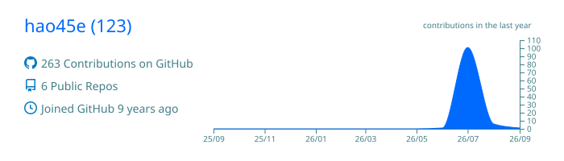
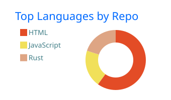
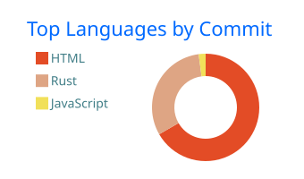
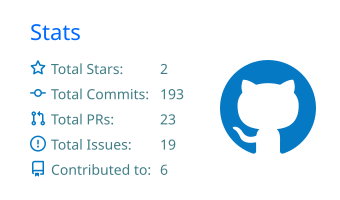
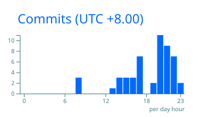

# hao45e

**The world is vast**

`AI` · `Web3` · `Cybersecurity` · `Metaverse` · `Psych` · `Anime`

 

  

<picture>
  <source media="(prefers-color-scheme: dark)" srcset="https://raw.githubusercontent.com/hao45e/hao45e/output/github-contribution-grid-snake-dark.svg" />
  <source media="(prefers-color-scheme: light)" srcset="https://raw.githubusercontent.com/hao45e/hao45e/output/github-contribution-grid-snake.svg" />
  
</picture>

