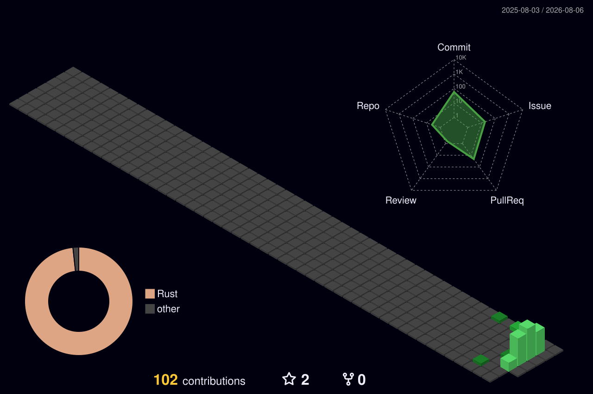
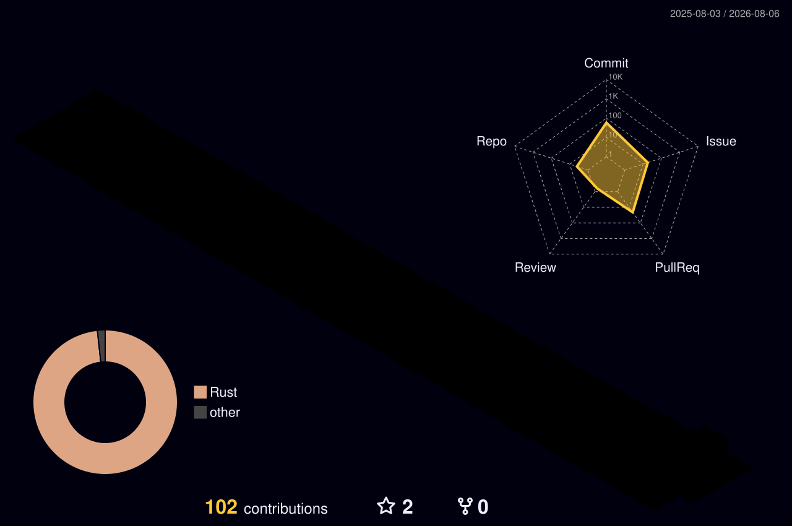
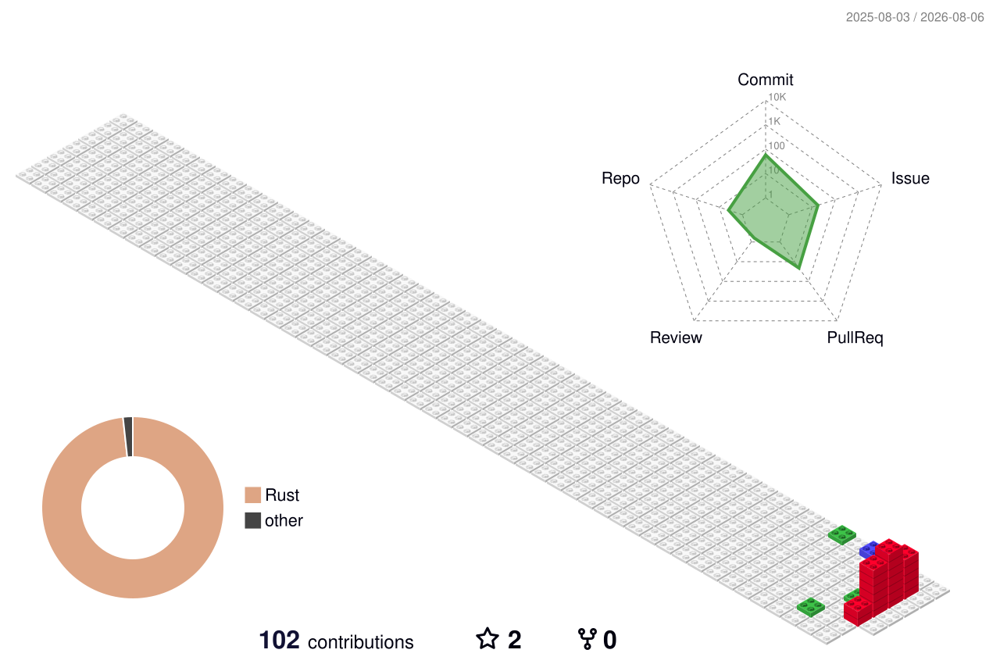
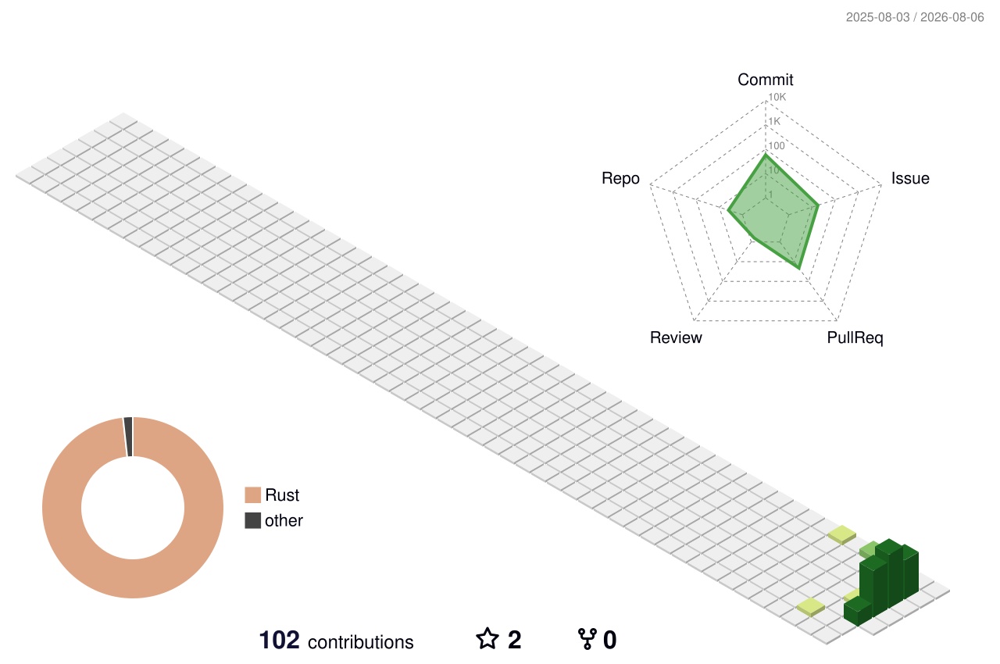
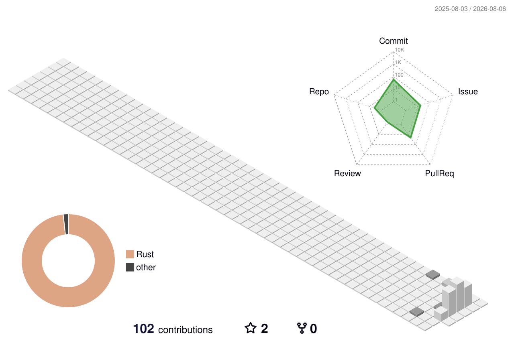

# 3D 贡献日历 — 配色挑选

一次生成 10 种，挑一个告诉我编号，我把它放进 README，其余的删掉。
全程零 token，Actions 自带凭证即可。

> 挑完这个文件就可以删。

---

### 1. night-view — 夜景

### 2. night-green — 夜景 · 绿

### 3. night-rainbow — 夜景 · 彩虹

### 4. gitblock — 积木风

### 5. season-animate — 四季 · 动画

### 6. season — 四季 · 静态

### 7. green-animate — 经典绿 · 动画

### 8. green — 经典绿 · 静态

### 9. south-season-animate — 南半球四季 · 动画

### 10. south-season — 南半球四季 · 静态

